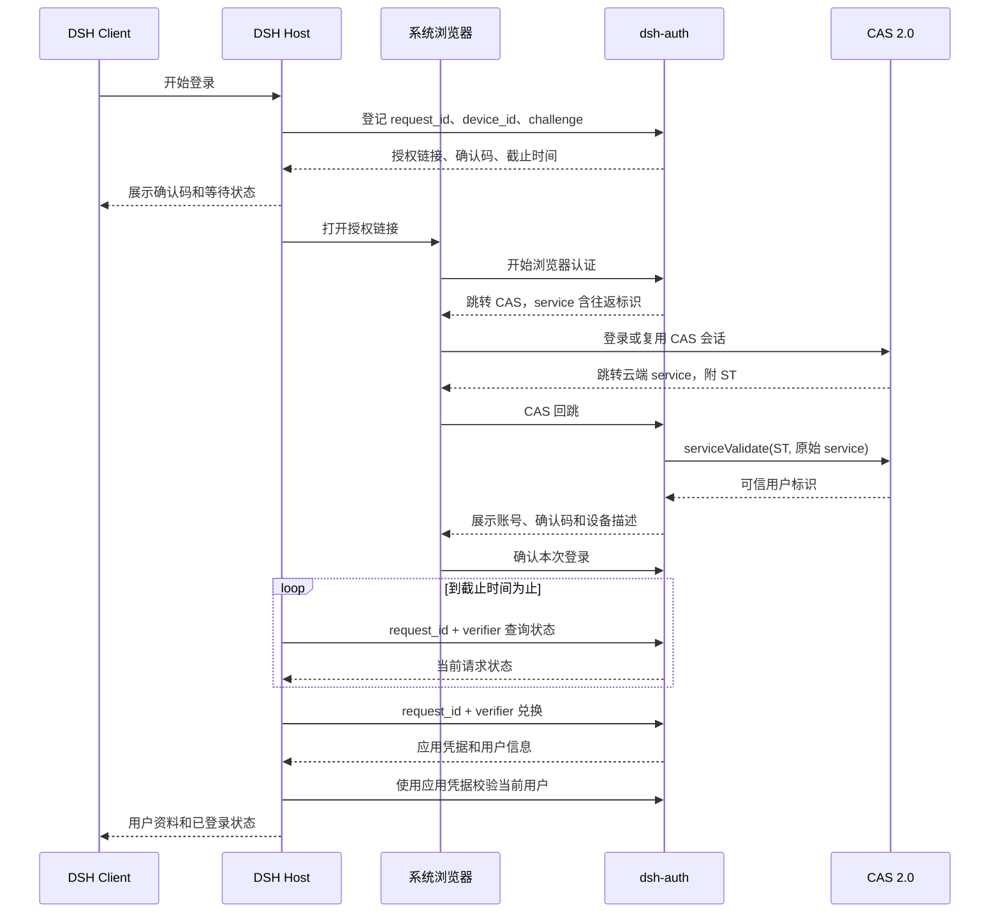

# Design

## Context

本设计面向 `add-private-desktop-cas-login` 的首期实现；动机与范围见 [proposal.md](proposal.md)，验收行为见 [企业 CAS 登录](specs/enterprise-cas-login/spec.md)、[桌面准入](specs/desktop-enterprise-admission/spec.md)和[插件装配](specs/enterprise-deployment-composition/spec.md)。下列接口、配置和接入点是待实现设计，不代表当前仓库已提供这些能力。

原生 Platform 登录在 Host 生成 verifier 和摘要，通过本机 `/oauth/callback` 收取结果。本方案复用每次尝试的证明机制，改由云端接收 CAS 回跳，再由 Host 主动领取结果。`sso-cas/app1` 使用 CAS 3.0 验票且仅演示 Web 会话，不能直接充当 DSH 登录服务；配套服务由 `sso-cas/dsh-auth` 承担。

现有 `connection/request` 位于 HTTP 准入之后，Gateway 的 WebSocket upgrade 单独调用 `connection.admit`；只增加 HTTP 监听器无法覆盖全部业务入口。Desktop 原生欢迎页先于 Client 插件运行，恢复流程可能禁用第三方 bundle。因此强制认证需要少量通用原生扩展，不能仅靠一个可卸载插件保证。

## Goals / Non-Goals

**Goals:** 确定逐次请求关联、云端状态事务、Host 凭据生命周期、Desktop 必需认证装配及验证顺序，使后续任务可以分别实现服务端、插件和通用接入点。

**Non-Goals:** 不实现 TokenHub 客户端或模拟授权结果，不更改 Agent Session 格式，不实现 CAS 全局单点注销，不提供共享 Web 多用户隔离，不承诺对抗修改本地程序或读取同一操作系统账号文件的用户。

## Decisions

### 1. 云端中转与模块职责

采用系统浏览器认证、云端确认和 Host 主动查询的组合。CAS 只注册 `dsh-auth` 这一服务；每台 DSH 安装实例不是独立 CAS service。云端没有任何连接员工电脑的步骤，也不使用自定义 URI scheme 或本机 HTTP 回调作为凭据交付机制。

`share/` 包含 Host 服务、Client 登录界面、HTTP 协议类型和 bundle；企业目录只提供非敏感配置及确有必要的适配。服务端负责 CAS 验票、登录请求与应用会话，后续 TokenHub 集成也归服务端。一期不预建默认通过的授权 provider。

### 2. 请求证明与浏览器往返分别关联

Host 每次新登录生成随机 `request_id` 和 32 字节密码学随机 verifier，使用 base64url 编码和 SHA-256 摘要；安装级 `device_id` 持久保存但不作为身份认证。请求绑定 `enterprise_id`、`app_id`、`device_id`、challenge 及设备描述，不接受客户端提交的用户名作为身份。

浏览器授权链接只包含公开 request_id。首次页面 GET 不改变认证状态；用户点击开始后，以 CSRF 保护的 POST 建立浏览器往返记录。服务端为该记录生成另一枚随机 `round_trip_id`，绑定浏览器会话和 request_id。一个浏览器会话最多持有一个未结束往返，竞争请求通过数据库原子占用决定，不能只依赖 HttpSession 的最后写入值。

提案中的“固定云端回调”在实现上指固定 HTTPS origin 和路径：`{publicBaseUrl}/login/cas?flow={round_trip_id}`。动态参数只由服务端生成，不能携带 verifier 或任意返回地址。服务端保存发起 CAS 登录时的完整 service 字符串，并用它调用 `/serviceValidate`；不根据收到的 Host、转发头或去掉参数后的 URL 重建 service。[CAS 2.0 规范](https://apereo.github.io/cas/8.0.x/protocol/CAS-Protocol-V2-Specification.html)要求验票传入票据对应的 service。

CAS 注册规则仅允许该部署的固定 origin、固定路径及规定长度与字符集的 flow；拒绝额外参数、其他路径及用户指定 return URL。上线前用真实 CAS 验证查询参数保留和 service 匹配，不因注册失败放宽成通配域名。

回跳同时核对 flow、浏览器会话、往返状态、关联请求状态及截止时间。先原子占用该往返的验票处理权，再在事务外访问 CAS；验票后条件更新原请求。A 的回跳永远只查 A 的记录，即使浏览器已开始 B，也不能把 A 的票据用于 B。验票网络结果不确定时废弃该往返并要求重新登录，不重复消费 ST；重放和失败不得重置其他请求。

验票成功后转入干净的确认页，显示可信账号、确认码和经转义的设备描述。确认、拒绝均需浏览器会话与 CSRF 证明；CAS 已登录也不能省略确认。确认码用于人核对，不是兑换秘密。回跳与验票请求日志隐藏 ticket，页面使用 `Cache-Control: no-store`、`Referrer-Policy: no-referrer`，不加载第三方资源。

不采用“固定 service 加浏览器当前 request_id”的方案，因为旧回跳到达新请求时仍可能串号；也不依赖 CAS 回传协议外的自定义 state 参数。

### 3. 首期 HTTP 接口

接口版本为 `/api/v1`，仅由 Host 调用；浏览器只访问授权页面和 CAS 回跳。应用标识公开，不向桌面分发静态 client secret。所有响应禁止缓存，Host 验证 JSON 和配置的服务 origin，携带秘密的请求不自动跟随跨 origin 重定向。

| 接口 | 请求与鉴权 | 成功响应及用途 |
|---|---|---|
| `POST /login-requests` | 企业、应用、安装及请求标识，challenge、`challenge_method=S256`、设备描述；同一请求重试额外提交 verifier | request_id、verification_uri、user_code、expires_at、interval_seconds；新建返回 201，合法重复返回 200 |
| `POST /login-requests/{id}/status` | JSON 请求体含 verifier | status、expires_at、interval_seconds；不返回用户资料或令牌 |
| `POST /login-requests/{id}/cancel` | JSON 请求体含 verifier | 原子取消后的真实状态；已兑换时返回冲突，不宣称撤销 |
| `POST /login-requests/{id}/exchange` | JSON 请求体含 verifier | access_token、token_type=Bearer、expires_at、session_id、user；仅返回一次 |
| `GET /me` | `Authorization: Bearer …` | session_id、expires_at、user，用于恢复和在线校验 |
| `POST /logout` | 相同 Bearer 凭据 | 204；将此应用会话撤销，重复退出不重新激活会话 |

user 必含 enterprise_id、issuer、subject；display_name 等资料只在可信资料源提供时返回。CAS 2.0 首期允许仅展示 subject，不凭空补部门、权限或额度。issuer 采用配置的 CAS 身份源标识，subject 保留其身份语义，不自行大小写折叠。应用会话另外绑定服务环境、app_id 和 device_id，不能跨环境使用。

首次登记不需要 verifier 明文；重复登记必须证明持有 verifier，匹配所有原绑定字段后才返回原记录，不能延长 TTL。即使知道 challenge，也不能抢占或覆盖已有请求。网络丢失导致首次创建结果不确定时，Host 以同一 request_id 加 verifier 重试。

错误响应提供稳定 code 和安全文案：参数错误 400、无效证明或令牌 401、状态冲突 409、通过证明后的请求过期 410、限流 429、依赖不可用 503。未通过证明的未知 ID 与错误证明不泄漏请求详情。429 返回 Retry-After；Host 遵守查询间隔并加入有上限的退避，截止后停止。请求、参数及错误日志不包含请求体秘密。

### 4. 共享状态与一次性兑换

首期选择 PostgreSQL 保存请求、浏览器往返及应用会话，以数据库事务处理确认、取消和兑换；浏览器会话采用 Spring Session JDBC 共用数据库。[Spring Session JDBC](https://docs.spring.io/spring-session/reference/configuration/jdbc.html)提供关系数据库会话持久化。本选择新增数据库部署依赖，但避免同时维护 Redis 原子脚本和另一套会话持久层；不以进程内 Map 作为生产实现。

| 记录 | 关键字段与约束 |
|---|---|
| login_request | 企业与应用、request_id 唯一键、device_id、challenge、状态、确认码、用户、创建与截止时间、已兑换会话 ID |
| browser_flow | flow 唯一键、浏览器会话关联、request_id、原始 service、处理状态与截止时间；浏览器当前占用原子更新 |
| app_session | session_id、令牌摘要唯一键、身份与请求绑定、签发/到期/撤销时间；同一 login_request 最多一条会话 |

请求状态为 `pending_auth → pending_confirmation → approved → exchanged`；非终态可转入 cancelled 或 expired，确认时可转入 rejected。exchanged、cancelled、rejected、expired 均不可返回可兑换状态。验票占用状态保存在 browser_flow，不改变公开请求状态枚举。

兑换事务锁定请求，按数据库时间验证 approved 与截止时间，生成高熵 opaque token，插入仅存摘要的应用会话并标记 exchanged；提交后才发送明文令牌。事务失败不发令牌；提交后响应丢失，客户端重新登录，未领取会话到期清理。取消使用同一锁及状态条件，不能覆盖已提交的兑换。

选择 opaque token 而非自包含 JWT，因为一期只有一个验证服务，数据库撤销与 `/me` 校验即可满足需求，无需增加签名密钥轮换及撤销列表。服务端不存可重新返回的明文令牌，不实现 refresh token。请求过期检查发生在每次状态转换，清理任务不承担正确性；数据库失联时拒绝创建、兑换和会话验证。

迁移脚本由 dsh-auth 管理，采用递增版本；请求及过期会话按配置保留短期故障诊断信息，不记录 ST 或 verifier。所有实例访问同一数据库；不使用从库的延迟读取判断授权或撤销。

### 5. 登录生命周期与本地数据

采用用户确认的策略：保存应用凭据，每次启动在线调用 `/me` 后才允许业务访问，不提供离线宽限。一期应用会话使用固定有效期，不静默续期；到期后重新走 CAS 登录与确认。部署默认建议登录请求 5 分钟、查询间隔 2 秒、应用会话 8 小时、流状态复核间隔 60 秒、网络请求超时 10 秒，全部为经校验的配置字段，企业可调整。

Host 状态包括 signed_out、authenticating、validating、authenticated、unavailable 和 expired。新的顶层业务操作、新模型步骤及工具执行先完成在线校验；并发校验可以合并正在执行的同一个请求，不跨后续操作缓存成功结果。长连接建立和每条业务消息同样检查，静默订阅按配置周期复核。失联检测不是瞬时的；失败或超时一经观测，立即暂停新操作并关闭业务订阅。

网络错误保留本地凭据但不授予访问，恢复后可重试 `/me`；401、过期或用户主动退出清除凭据。本地退出先撤销本地准入、增加认证代次并停止轮询，再尝试服务端撤销；远程失败明确提示未确认，不恢复本地会话，也不自动退出 CAS。

每次登录尝试及每次用户切换都有 Host 代次。保存凭据、网络校验返回、打开工作区等异步结果必须仍属于当前代次。旧兑换成功结果不接纳；若已收到其令牌，尽力撤销但不声称必然成功。新尝试不能继承前一账号的准入结果。

凭据由 Host 使用现有 credentials 能力持久保存，按 enterprise_id、服务 origin 和 app_id 隔离，记录 schema_version；未知版本拒绝恢复并提示重登录。只向 Client 公开用户与安全状态，不导出令牌、verifier 或 CAS cookie。该存储不提供对同一 OS 用户的秘密隔离；模型工具不主动获得凭据，但本期不能承诺阻止具有同 UID 文件读取权限的进程读取凭据。

用户明确选择允许不同 CAS 账号共用本地会话、工作区及现有模型配置。退出不删除这些数据；B 登录后可以看到 A 在该本地 DSH 数据目录中的内容。此选择不将历史会话重新归属 B，也不构成服务端账号隔离。切换时必须先结束旧账号的运行收尾；存在活动工作时可登录验证，但不能对新账号开放工作区，避免旧任务与新身份并行使用。

### 6. 收尾与禁止新操作的精确定义

用户选择允许当前任务收尾而非强制杀死进程。失效时已进入执行体的模型请求、工具调用或子进程可以返回并完成结果落盘、资源释放；这不保证整个多步骤任务继续完成。后续模型步骤、工具调用、终端输入、文件操作及新任务均拒绝。已经执行的操作产生的副作用不回滚。

排队输入、计划触发和子任务不能凭旧登录态启动。现有 `agent/pre-step`、`tools/pre-execute` 与单调 ToolGuard 用于检查在线结果和认证代次，所有注册经 ctx.effect/ctx.on 管理；放行分支遵守 waterfall 的 next 委托要求。工具执行前同步 guard 复核代次，防止异步校验后退出造成迟到放行。无需改变 agent-loop。

失效后关闭用户业务订阅，但 Host 内部仍可持久保存已执行操作的结果。停止任务、结束终端和应用退出等收尾操作保留受本地传输认证保护的最小入口。已运行 shell 可以在自身进程中继续产生文件或网络副作用，不将“拒绝新的 DSH 操作”描述为撤销全部 OS 能力；长期运行操作由用户通过收尾入口停止。

### 7. 通用原生扩展与插件分工

新增通用 Host 业务准入服务，声明 provider、consumer 及撤销通知；部署要求由受支持的启动器读入，独立于可禁用的认证 bundle。无必需 provider 的普通发行版保持现有流程；声明必需 provider 的企业版默认拒绝，只有 provider 已就绪且校验成功才放行。provider dispose、配置失效或恢复模式禁用时回到拒绝状态。

| 接入位置 | 最小通用职责 | 企业插件职责 |
|---|---|---|
| Host Connection / Gateway | 保留原 Host、Origin、cookie 校验；HTTP 分发、WS upgrade、每条业务消息和订阅失效接入准入服务 | 提供 CAS 应用会话校验结果 |
| 直接文件及终端路由 | 在实际 handler 前检查业务准入；默认把未分类入口作为业务 | 不维护易漏项的私有 URL 黑名单 |
| Desktop 启动与 welcome | 在模型欢迎页和 enterWorkspace 前等待必需认证；模型 Key 和 Skip 不绕过 | 提供企业登录页面、状态和用户资料 |
| Desktop 恢复与 Host 启动 | 从发行策略传入不可由 bundle 移除的必需 provider 声明；缺失时保留修复入口 | 正常恢复加载后重新在线校验 |
| 构建与运行时装配 | 纳入选定 bundle 及 Client 静态产物，验证依赖和协议版本 | 提供独立构建产物及企业配置 |

未登录 bootstrap 页面通过既有本地传输认证加载，只能调用显式注册的登录、状态、取消、诊断和修复方法。诊断不包含任意文件读取或业务日志下载。Desktop 使用通用的启动认证页面入口，加载插件提供的页面；插件缺失时展示原生通用修复页。不能为让登录页面启动而开放完整业务 RPC。

必需准入的最小执行与拒绝逻辑由通用 Host 组件拥有，插件不能通过卸载解除。还需覆盖后台调度与工具 guard 的注册归属，使运行时禁用 provider 后仍保持拒绝。业务入口清单与实际注册的覆盖检查是交付条件；只接通 connection.admit 不算完成。

这些扩展不包含 CAS 地址、企业名称或 TokenHub 判断。原生文件改动仍有升级适配成本，但不复制 main、Connection 或通过运行时替换内部方法维持私有分支。

### 8. 插件构建与企业选择

在 `pro/dsh-pro-auth/` 根设置一个 private workspace 包，遵循仓库命名约定使用 `@deepseek-ai/dsh-pro-auth`，用户功能名保持 dsh-pro-auth。Host、Client、共享协议和企业入口分别导出；Host 与 Client 使用独立 leaf tsconfig，根 tsconfig 仅作 solution。模块内的 share、hxfl、superbpm 目录保持用户指定布局。

workspace 精确纳入此包，补齐 TS 引用、构建、检查和依赖锁定，不为所有未来 pro 目录设置未经验证的自动发布范围。bundle 的依赖声明与 Cordis patch 一起维护，开发装配继续使用 dsh profile 与 overlay，不新增直接 Node 应用启动器。

Desktop 构建显式选择一个企业，提取对应 bundle、配置及必须认证声明；发布 staging 仅收集公共实现和选中企业入口，不把整个含其他企业配置的 workspace 包原样复制。普通构建不收集企业产物。预装包解析、profile 持久化、升级重建和恢复修复必须实际接通，不能只增加 preinstalledBundles 配置字段。

所有企业配置只包含服务地址、应用标识、显示信息及校验策略。Host 固定允许的认证 origin，云端固定 CAS service，不通过用户界面接受任意服务地址。数据库口令等服务端秘密通过部署注入。构建检查清理 staging 后分别验证 hxfl、superbpm 和普通版，缺失选定配置或插件产物直接失败。

## Risks / Trade-offs

- CAS 注册未允许精确的 flow 查询参数 → 用真实 CAS 2.0 验票测试作为上线条件，保留原始 service，禁止以取消往返绑定解决兼容问题。
- 公开授权链接可被转发 → 浏览器必须显示账号和匹配码并明确确认；verifier 防跨客户端领取，但不能阻止用户主动批准攻击者请求的社会工程行为。
- 在线逐操作验证增加网络延迟和服务负载 → 合并同时在途验证、使用连接池、配置限流与超时；一期不以离线缓存换取可用性。
- 已兑换响应丢失会留下未使用会话 → 固定短有效期、服务端过期清理，客户端重新认证，不引入可重复领取秘密的接口。
- CAS 账号停用或 CAS 退出不会自动撤销已签发应用会话 → 一期以应用会话到期和应用撤销为准，不承诺全局 SLO；后续企业授权单独设计。
- 本地账号切换共用数据、同 UID 可读取凭据、既有子进程仍可运行 → 按已确定的一期信任范围呈现行为，不将 CAS 登录宣传为本地数据或 OS 安全隔离。
- 通用准入接入遗漏、恢复模式去掉插件 → 默认拒绝未知业务分类，对缺失 provider、已连接通道和后台入口做反向测试，企业包必须通过恢复场景验证。
- 新增数据库及跨仓库部署 → 服务端先发布，客户端按 API 版本检查；本 OpenSpec 只记录 sso-cas 工作依赖，本次不修改该项目。

## Migration Plan

1. 在后续服务端实施任务中创建 dsh-auth，加入数据库迁移、CAS 2.0 注册、HTTPS 代理及日志脱敏；保留 App1 演示用途。部署地址作为配置输入，不复用 App1 的 service 注册。
2. 先验证无 DSH UI 的请求创建、浏览器确认、交换、`/me` 和撤销，覆盖多实例、旧回跳、并发取消与兑换、丢失响应；测试环境不部署 TokenHub。
3. 实现通用必需准入和 Desktop 启动入口，先用测试 provider 验证业务封锁、原生 welcome、既有连接、后台任务及恢复路径，再接企业插件。
4. 完成插件、企业装配及 Desktop 包验证。旧 API Key 保留但不赋予企业准入；已有本地数据无需 Session 格式迁移，首次企业启动仍在线登录。
5. 执行协议单元测试、真实数据库并发测试、CAS 2.0 联调、Host 业务反向测试、UI 状态测试及适用的 keyless 会话快照。重点覆盖新工具调用被拒绝而已执行操作可收尾、账号切换共用数据和普通版不访问 CAS；验证模型输出及日志无秘密。
6. 先试用选定企业包再推广。回退使用上一可工作的企业包及匹配插件；不能通过禁用认证回退。数据库迁移优先增量兼容，破坏性修改前备份；新客户端不支持旧 API 时停留在诊断状态。回退到不要求登录的普通版属于发行策略变更，不自动执行。

## Open Questions

- dsh-auth 的正式域名、证书、数据库连接与各企业 app_id，由部署时填写；不改变上述协议和代码职责。
- 登录请求与会话有效期等配置采用上述建议初值，可在联调时按企业策略调整，须同步配置验证和过期场景。
- 展示姓名是否有可信资料源，待企业 CAS 数据确认；缺失时仅展示已验票 subject，不阻塞首期闭环。
